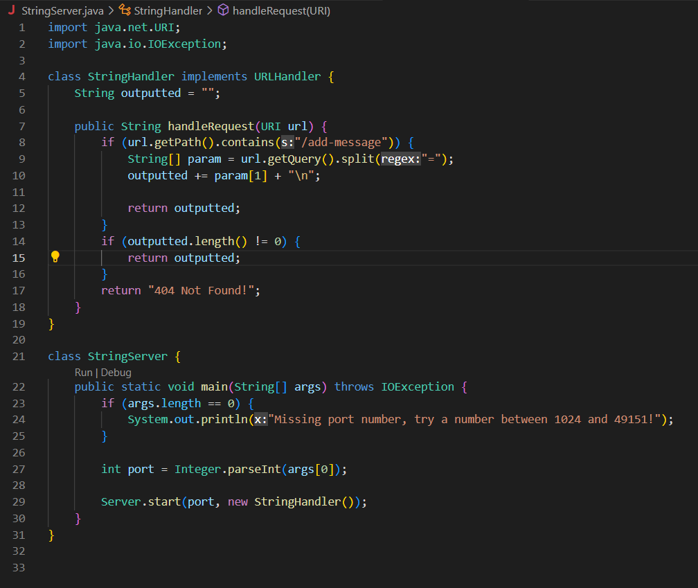

## Part 1

### Code for my `StringServer`:

 

### Examples of `StringServer`:

 

 

## Part 2

### Failure-Inducing Input For Buggy Program

#### Associated Code:

`Code here`

#### Junit Test:

`Code here`

### Input That Doesn't Induce A Failure

#### Associated Code:

`Code here`

#### Junit Test:

`Code here`

### Symptom From Running The Tests

### Fixing The Bug

#### Before:

`Code here`

#### After:

`Code here`

## Part 3

From the labs, I have learned a lot of information that I did not know before. Before coming to UCSD, I had no prior knowledge about coding and barely anything about how URLs work, so everything we have been learning from the labs and from lectures has been new to me.

From lab 2, I learned 

From lab 3, I practiced and became more comfortable with using Junit tests, especially with understanding the command line arguments we use to run the tests which was never explained in CSE 12. I learned that <mark>;</mark> or <mark>:</mark> is used to separate paths where Java will look for classes, that <mark>.jar</mark> is a file format simlar to a <mark>.zip</mark> file but for classes.
