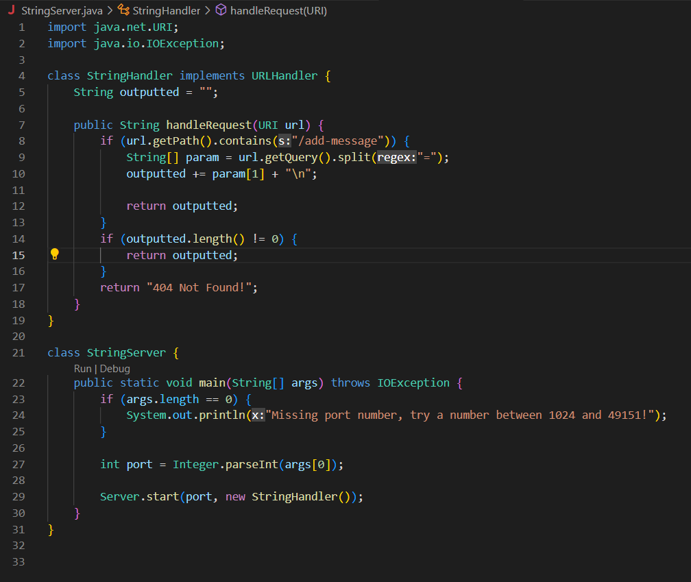
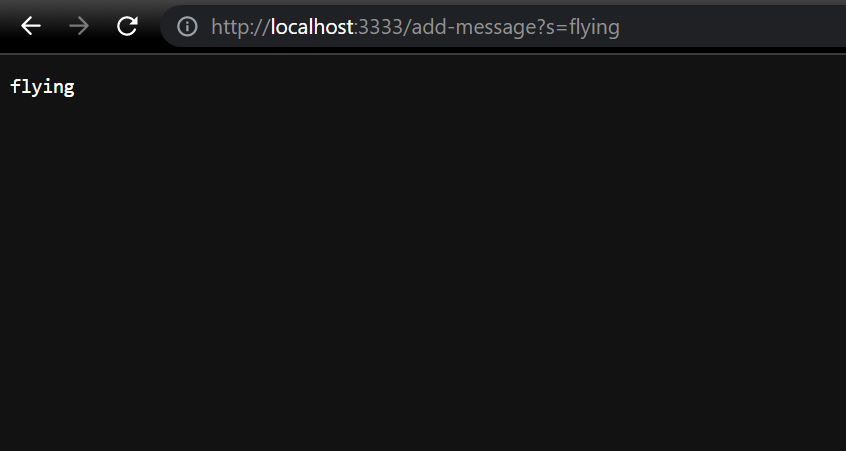
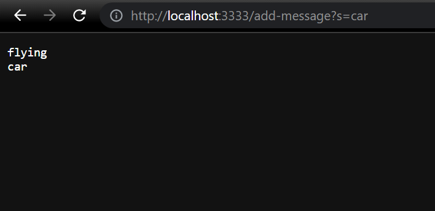
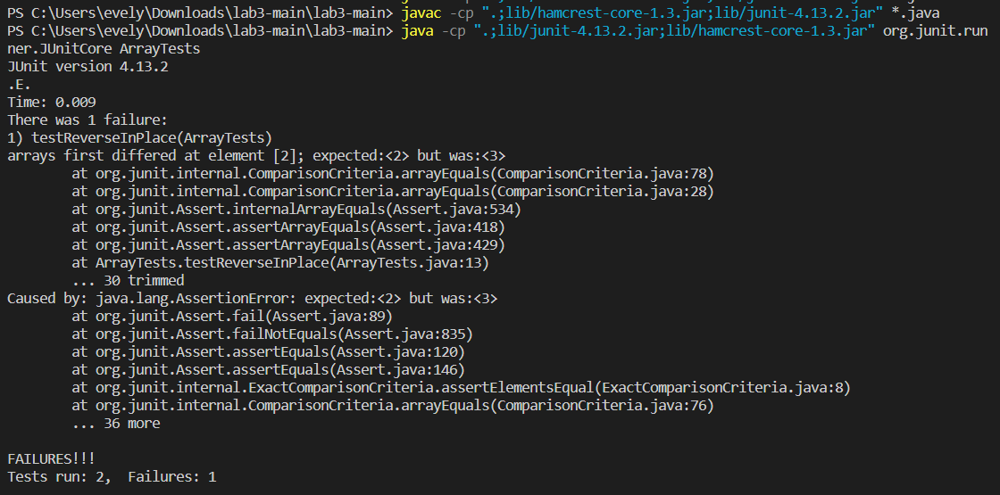
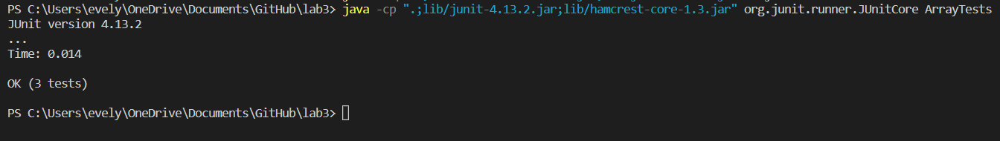

## Part 1

### Code for my `StringServer`:

 

### Examples of `StringServer`:

The <mark>main</mark> method of the StringServer class is called to start the server with the port 3333, and the <mark>handleRequest</mark> method in the class StringHandler is called to perform the change to the page when we want to add a message. The relevant argument to the <mark>main</mark> method is args[0], the port number which is entered on the command line for the web server (3333 in this case). The argument of the <mark>handleRequest</mark> method is the url, where if it contains "/add-message", then we want to split the url's path by "=" into an array <mark>param</mark> of strings. 

We then would take the second element of that array to be the string we will add to our output. This is done by adding the string + "\n" to a value called outputted, then returning outputted in the end. Every time we add a new string, it will continue on the next line. The value of the string being added does not change, it is simply added to the server's output as it is typed after the "=" in the URL.

In this case, we added "flying" as the output as our first string.

 

With the server already running, we do not need to recall the <mark>main</mark> method in order to use the server again. However, we are still calling the method <mark>handleRequest</mark> again to add another string to our output. The value/variable outputted should read as "flying" + "\n" + "car" + "\n" after adding this second string through the URL. We are again splitting the url's path by "=" into an array of strings and taking the second argument of this array <mark>param</mark> to add to the value/variable "outputted". This is returned in the end and leads to the output we see on the server.

Our list on the server at this point reads:

`flying
car`

 

 

 

 

## Part 2

### Failure-Inducing Input For Buggy Program

#### Associated Code:

`static void reverseInPlace(int[] arr) {
    for(int i = 0; i < arr.length; i += 1) {
      arr[i] = arr[arr.length - i - 1];
    }
  }`

With this for-loop in <mark>reverseInPlace</mark>, arr[0] will copy over as arr[3] and arr[1] as arr[2], but then arr[2] would become whatever value is in arr[1], which has already been reassigned as arr[2]. The loop running for arr.length number of iterations will cause the second half of this asymmetric loop to be written twice in the array instead of reversing it.

#### Junit Test:

`int[] input2 = {1, 2, 3, 4};
ArrayExamples.reverseInPlace(input2);
assertArrayEquals(new int[]{4, 3, 2, 1}, input2);`

This causes Junit to give the output: “arrays first differed at element [2]; expected:[2] but was:[3] at ArrayTests.testReverseInPlace(ArrayTests.java:13)”

The final output would be {4, 3, 3, 4} instead of the expected {4, 3, 2, 1}.

 

### Input That Doesn't Induce A Failure

#### Associated Code:

`static void reverseInPlace(int[] arr) {
    for(int i = 0; i < arr.length; i += 1) {
      arr[i] = arr[arr.length - i - 1];
    }
  }`
  
 

#### Junit Test:

`public void testReverseInPlace() {
    int[] input1 = {2, 3, 2};
    ArrayExamples.reverseInPlace(input1);
    assertArrayEquals(new int[]{2, 3 ,2}, input1);
	}`

This will pass on Junit, because the array is symmetrical.

 

### Symptom From Running The Tests

 

### Fixing The Bug

#### Before:

`static void reverseInPlace(int[] arr) {
    for(int i = 0; i < arr.length; i += 1) {
      arr[i] = arr[arr.length - i - 1];
    }
  }`

#### After:

`static void reverseInPlace(int[] arr) {
    int val = 0;
    for(int i = 0; i < arr.length / 2; i += 1) {
      val = arr[i];
      arr[i] = arr[arr.length - i - 1];
      arr[arr.length - i - 1] = val;
    }
  }`

The code is now fixed to have the local variable <mark>val</mark> which will store the value of arr[i] so we are not copying the second half of the array over twice as we try to access the values in the first half of the array later only for it to be overwritten in the case of the previous code. The length of the loop will only run for arr.length / 2 number of iterations as well.

The new code works by assigning val to the value of arr[i], then changing arr[i] to be the value arr[arr.length - i - 1]. Afterwards, the code changes the current value of arr[arr.length - i - 1] to be whatever we previously stored in val. We are changing two values of the array simultaneously with each iteration of the loop, so this is why we only run the loop for half of the length of the array. The variable <mark>val</mark> helps us keep the value of the current arr[i] to assign it to the second half of the array.

 

Both tests pass now on Junit.

 

 

 

 

## Part 3

From the labs, I have learned a lot of information that I did not know before. Before coming to UCSD, I had no prior knowledge about coding and barely anything about how URLs work, so everything we have been learning from the labs and from lectures has been new to me.

From lab 2, I learned how to use Github Desktop to clone a repository from the internet, and to commit and push changes made to my code. Additionally, I learned what forking a repository means, what a port and localhost are, how to run a server on a remote computer, and how to access a URL from the command line using <mark>curl</mark>.

From lab 3, I practiced and became more comfortable with using Junit tests, especially with understanding the command line arguments we use to run the tests which was never explained in CSE 12. I learned that <mark>;</mark> or <mark>:</mark> is used to separate paths where Java will look for classes, that <mark>.jar</mark> is a file format simlar to a <mark>.zip</mark> file but for classes. I also learned that <mark>*</mark> allows you to tell javac to compile all the files in the given directory.

 

 

 
