# Lab Report 4: Doing it All from the Command Line
## __Timing Tasks__
*Evelyn Quan, CSE15L Section A05*

<br/>

### Step 1: Delete existing forks of repository on account

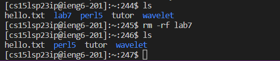

I first used the `rm -rf path-to-directory` command to delete my existing fork of the repository and all its contents from my Github account.

<br/>

### Step 2: Fork the repository

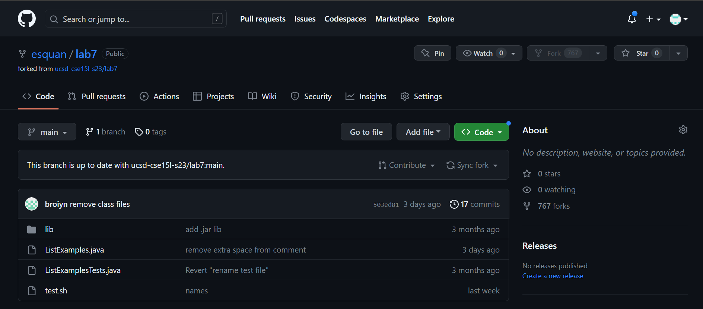

I visited this [link](https://github.com/ucsd-cse15l-s23/lab7) to the Lab 7 repository and forked it again.

<br/>

### Step 3: Start the timer

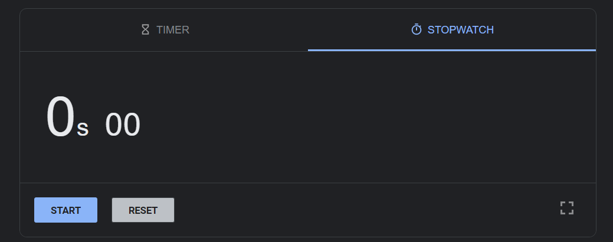

I got the timer ready and pressed "Start" as I began to do Steps 4 to 9.

<br/>

### Step 4: Log into ieng6

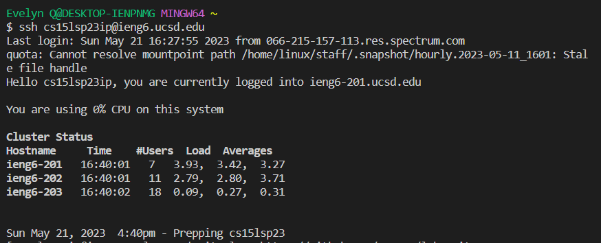

First, I logged into ieng6 with `ssh cs15lsp23ip@ieng6.ucsd.edu`. Because we previously generated an SSH key for ieng6, I did not have to enter the password.

<br/>

### Step 5: Clone your fork of the repository from your Github account

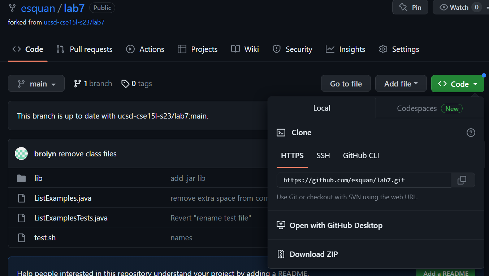

I visited my fork of the Lab 7 repository on Github and copied the HTTPS url in order to clone the repository.

<br/>

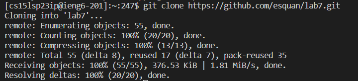

I then used the `git clone` command as shown above with the URL I copied.

<br/>

### Step 6: Run the tests, demonstrating that they fail

*Keys typed:* `cd lab7` `h` `!263` `!264`

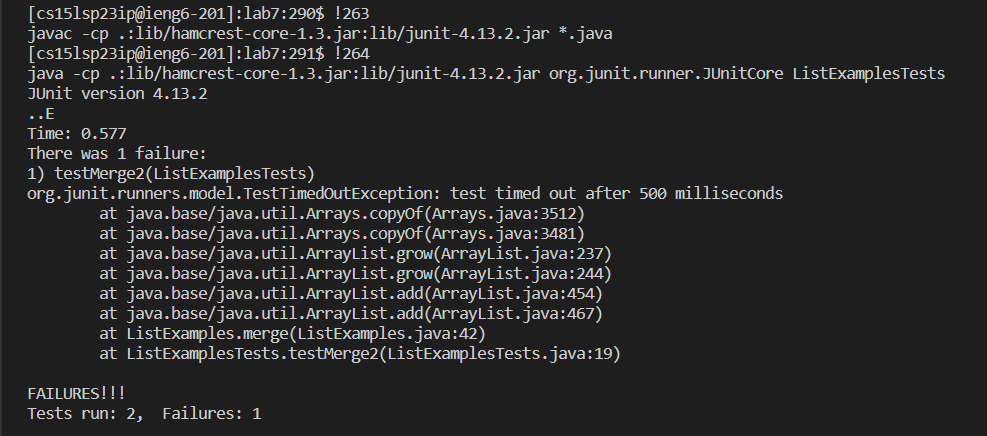

First, I changed my directory to go into the lab7 directory, then compiled and ran the code using respective `javac` and `java` commands. I did this by typing `h` in my terminal to access my command history, then found these commands on lines 263 and 264 in my history. I did the following to access these previous commands in order to run the tests in ListExamplesTests, and get the output as shown above (that 1 test failed):

```
[cs15lsp23ip@ieng6-201]:lab7:290$ !263
javac -cp .:lib/hamcrest-core-1.3.jar:lib/junit-4.13.2.jar *.java
[cs15lsp23ip@ieng6-201]:lab7:291$ !264
java -cp .:lib/hamcrest-core-1.3.jar:lib/junit-4.13.2.jar org.junit.runner.JUnitCore ListExamplesTests
```

<br/>

### Step 7: Edit the code file to fix the failing test

*Keys typed: /merge*

I first typed the command `vim ListExamplesTests.java` to open the file **ListExamplesTests.java** in Vim, then typed "/merge" to search for the merge method that we need to fix.

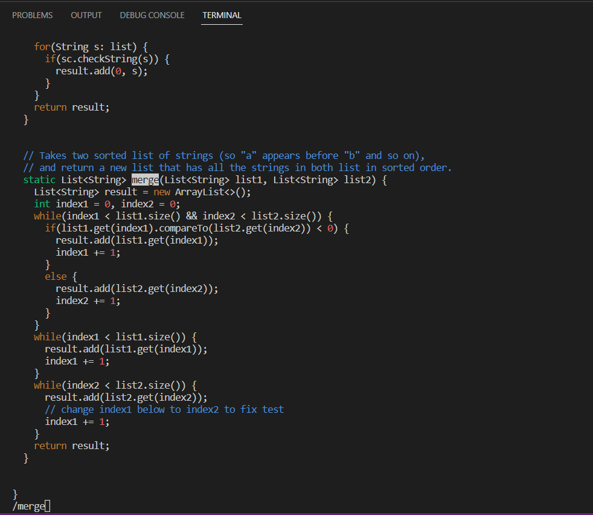

<br/>

*Keys pressed/typed:* `/index1 += 1;` `n` `n`

After doing so, I saw a comment on where to fix the bug in our program by changing "index1" to "index2", so I typed "/index1 += 1;" to search for this line, and pressed "n" 2 times to get down to this line.

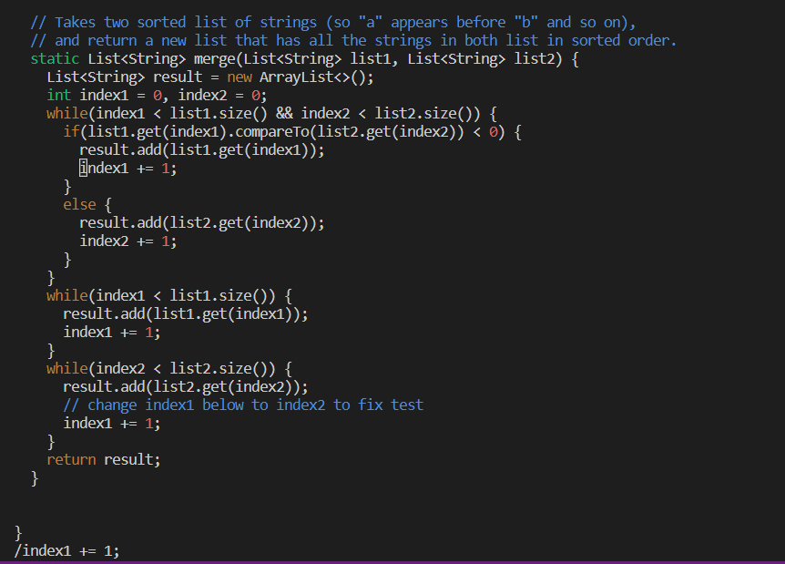

<br/>

*Keys pressed:* `1e` `x` `i` `2` `<esc>` `:wq`

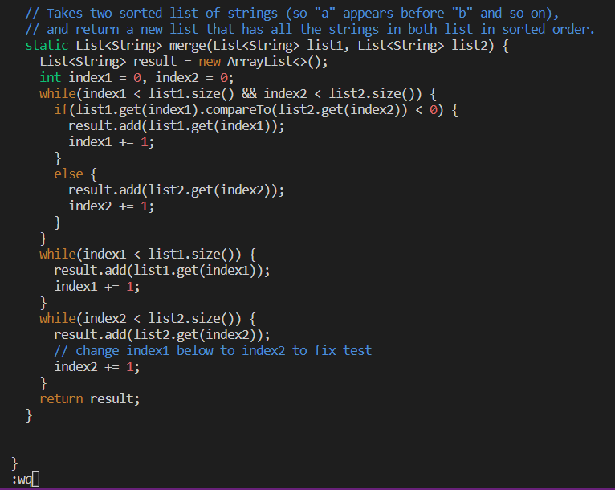

I typed "1e" to jump to the end of the first word, which was "index1". I then pressed "x" to delete the "1" character at the end of the word, then pressed "i" to go into insert mode on Vim. This allowed me to make edits to the text in the file, and so I typed "2" to make the word say "index2" now. Finally, I pressed `<esc>` to exit out of insert mode, then typed ":wq" to save my changes and quit out of Vim (w means save, and q means quit).

<br/>

### Step 8: Run the tests, demonstrating that they now succeed

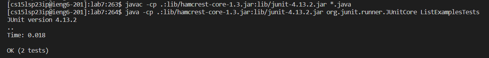

*Keys pressed:* `<up>` `<up>` `<up>` `<enter>` `<up>` `<up>` `<up>` `<enter>`

I pressed up 3 times and then "enter" in order to access the **javac** command that was 3 commands up in my history, then did the same thing with the **java** command that was 3 commands up in my history as well. I find that the Junit output now says that all my tests pass.

<br/>

### Step 9: Commit and push the resulting change to your Github account

#### **9a)**

```
[cs15lsp23ip@ieng6-201]:lab7:268$ git add ListExamples.java
[cs15lsp23ip@ieng6-201]:lab7:269$ git commit
```

I used these commands to add **ListExamples.java** to the commit that I want to push. After typing this, the following shows up:

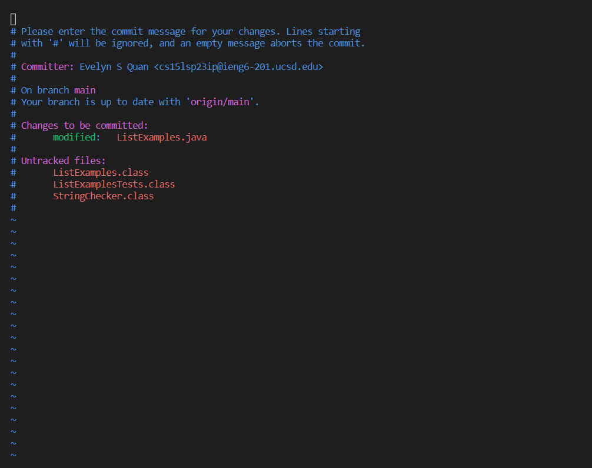

<br/>

#### **9b)**

*Key pressed:* `i` `<esc>` `:wq`
I press `i` to enter insert mode and then typed "Fixed the merge method in ListExamples" as my commit message. After, I exited out of insert mode with using the Esc key, then saved and quit with `:wq`

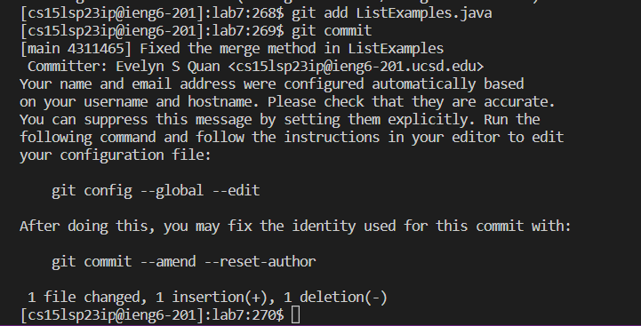

<br/>

#### **9c)**

After saving my commit message, I used the command `git remote remove origin` and then `git remote add origin <url>` with the SSH URL of my forked repository, found on the Github page for this repository (I used the SSH key to avoid any authentication issues with connecting this remote repository, since I previously used the HTTPS URL to clone this repository). Since using `git clone` earlier automatically set up my remote repository as my 'origin'

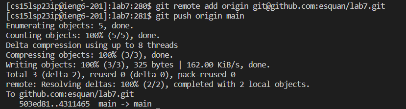

<br/>

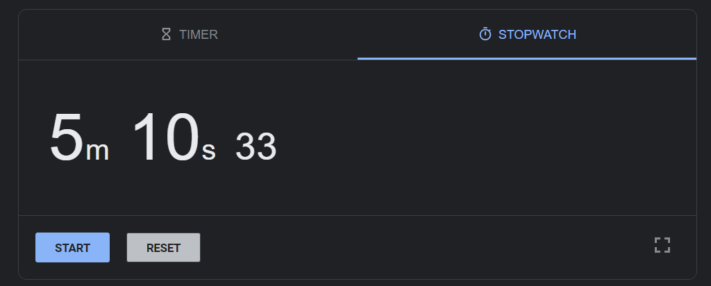

<br/>

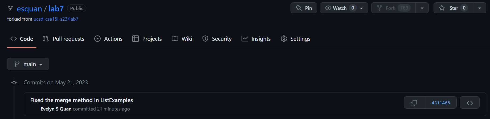

We see that the commit was successfully pushed to our Github account!

<br/>

*Keys pressed:* 

<br/>


