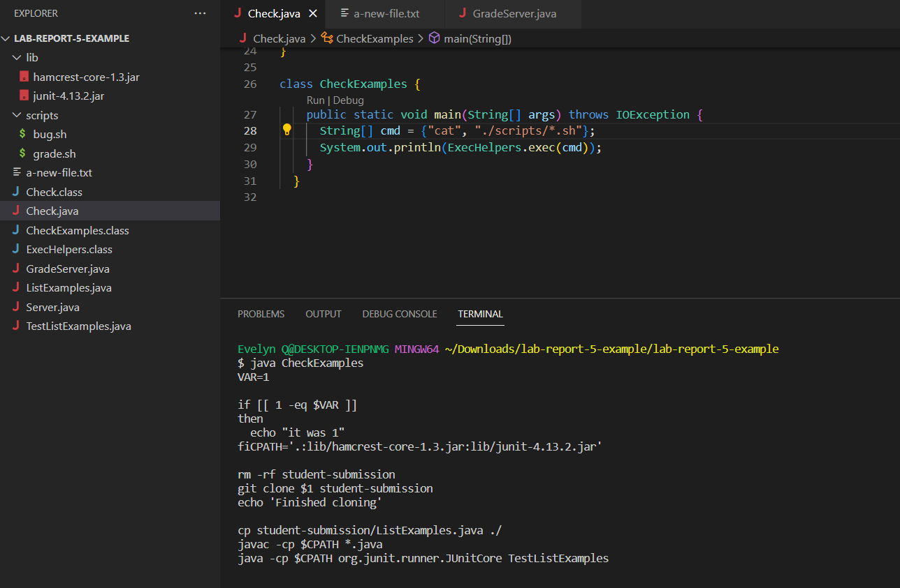
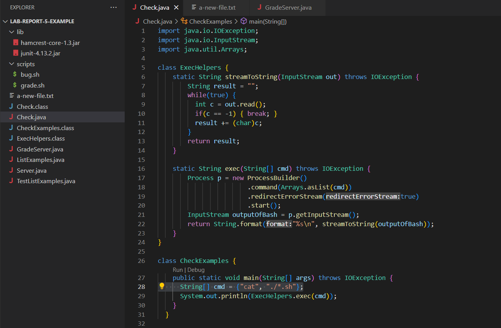
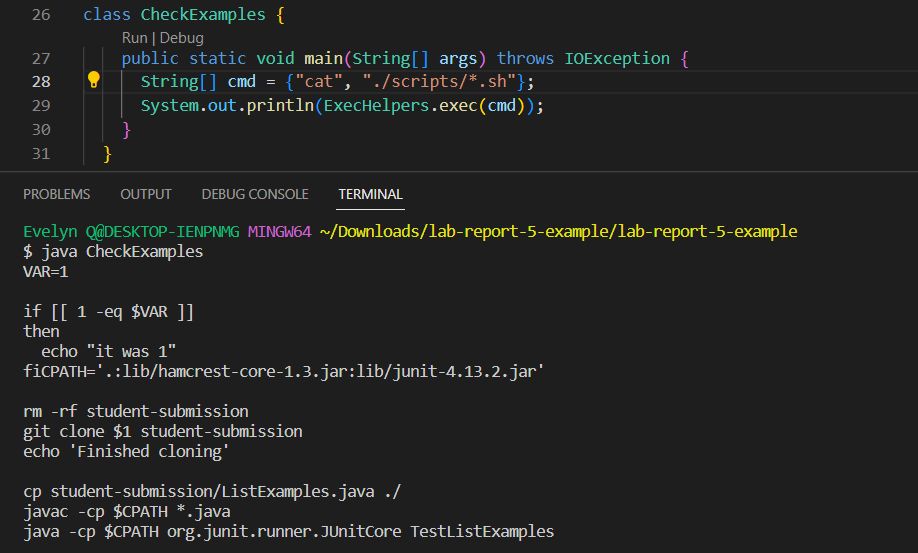

# Lab Report 5: Debugging
*Evelyn Quan, CSE15L Section A05*

<br/>

## Part 1 - Debugging Scenario

### Student's Post

__What environment are you using (computer, operating system, web browser, terminal/editor, and so on)?__

I am on a Windows laptop using VS Code with a Git Bash terminal open to run my commands.

__Detail the symptom you're seeing. Be specific; include both what you're seeing and what you expected to see instead. Screenshots are great, copy-pasted terminal output is also great. Avoid saying “it doesn't work”.__

I am seeing the following symptom, where running my CheckExamples class in order to run the bash command of 'cat' on all the bash script files in my directory. However, when running this command, I receive the output saying that "No such file or directory" exists.

I'm not really sure how to approach this issue, any help would be appreciated. Thanks!


<br/>

__Detail the failure-inducing input and context. That might mean any or all of the command you're running, a test case, command-line arguments, working directory, even the last few commands you ran. Do your best to provide as much context as you can.__

The failure-inducing input is trying to run the bash command `cat ./*sh` through compiling our Java file (`javac Check.java`) which creates a process where an array of strings representing the bash command is ran and its standard output and/or standard error found from reading the input stream is returned as a string. 

This is all done with our helper methods streamToString and exec, and then we try to run the class CheckExamples (`java CheckExamples`) to specifically run our example of the `cat ./*sh` command. There were no command-line arguments given besides the command to run CheckExamples. 

My working directory is 'lab-report-5-example/lab-report-5-example'. The last few commands I ran consisted of only the ones mentioned above.

<br/>

<br/>

### TA Response

Hi, good question! Here, the output is telling us that 'No such file or directory' exists for the path './\*.sh'. Think about what it could mean if the program could not find our bash scripts and that './\*.sh' is not recognizable as a path that leads to a valid .sh file.

You may want to check your current directory again. Are we already within the scripts folder, and can the bash scripts be accessed at our current level? How many levels deep into the Lab-Report-5-Example folder do we need to go in order to access the scripts, and is this reflected in the path written for the bash command? Try reconsidering how we might write the path towards the scripts with this in mind.

<br/>

<br/>

### Student's Attempt at TA's Suggestion

Hi, thank you for the suggestion! I realized that my bug was not writing the correct path to the bash scripts, and that my previous path would have only worked if the files were not in the scripts folder.

To change this, I made the path "./scripts/\*.sh" to represent the scripts being within the scripts folder that sits within our current directory. This way, we are able to access the file and use the cat command to see their contents.



<br/>

<br/>

### Overall Setup Information

- File and directory structure needed: We needed to access the **grade.sh** and **bug.sh** files within the scripts folder. The full directory structure to do this on my laptop was "~/Downloads/lab-report-5-example/lab-report-5-example/scripts/\*.sh". My current directory was "~/Downloads/lab-report-5-example/lab-report-5-example", so I wrote the path in my bash command as "./scripts/\*.sh".


- Contents of Check.java before fixing the bug: 



Where the highlighted portion is the bug in the program.

- The full commands I ran to trigger the bug:

```
javac Check.java
java CheckExamples 
// which also begins running the bash command:
cat ./*.sh
```

Output: `cat: './*.sh': No such file or directory`

- What to edit to fix the bug: I changed the path for `cat ./*.sh` to instead be `cat ./scripts/*.sh`, which is the correct path to the bash scripts in our current directory.



<br/>

<br/>

## Part 2 - Reflection

Something I learned from lab in the second half of the quarter was using Vim to access things solely from the command line. I found learning about Vim to be very useful and interesting, especially getting to try out the tutorial during lab. I ended up also getting to apply my knowledge of Vim very shortly after learning it 
