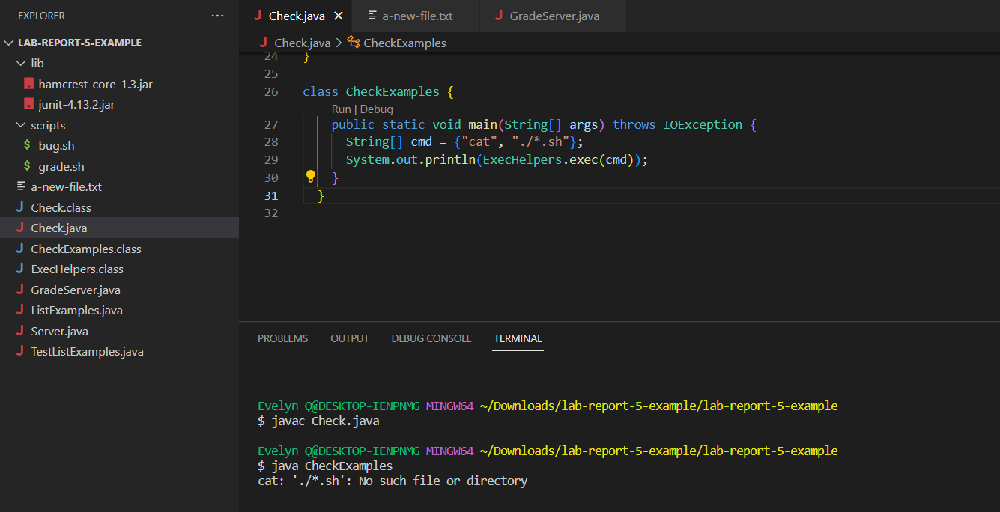

# Lab Report 5: Debugging
*Evelyn Quan, CSE15L Section A05*

 

## Part 1 - Debugging Scenario

### Student's Post

__What environment are you using (computer, operating system, web browser, terminal/editor, and so on)?__

I am on a Windows laptop using VS Code with a Git Bash terminal open to run my commands.

__Detail the symptom you're seeing. Be specific; include both what you're seeing and what you expected to see instead. Screenshots are great, copy-pasted terminal output is also great. Avoid saying “it doesn't work”.__

I am seeing the following symptom, where running my CheckExamples class in order to run the bash command of 'cat' on all the bash script files in my directory. However, when running this command, I receive the output saying that "No such file or directory" exists.

I'm not really sure how to approach this issue, any help would be appreciated. Thanks!

 

__Detail the failure-inducing input and context. That might mean any or all of the command you're running, a test case, command-line arguments, working directory, even the last few commands you ran. Do your best to provide as much context as you can.__

The failure-inducing input is trying to run the bash command 'cat ./\*sh' through compiling our Java file (javac Check.java) which creates a process where an array of strings representing the bash command is ran and its standard output and/or standard error found from reading the input stream is returned as a string. 

This is all done with our helper methods streamToString and exec, and then we try to run the class CheckExamples (java CheckExamples) to specifically run our example of the 'cat ./\*sh' command. There were no command-line arguments given besides the command to run CheckExamples. 

My working directory is 'lab-report-5-example/lab-report-5-example'. The last few commands I ran consisted of only the ones mentioned above.

 

 

### TA Response

Hi, good question! Here, the output is telling us that 'No such file or directory' exists for the path './\*.sh'. Think about what it could mean if the program could not find our bash scripts and that './\*.sh' is not recognizaable as a path that leads to a valid .sh file.

Check your current directory again. Does it include the scripts folder where the 

### Student's Attempt at TA's Suggestion

### Overall Setup Information

 

## Part 2 - Reflection

Something I learned from lab in the second half of the quarter was using Vim to access things solely from the command line. I found learning about Vim to be very useful and interesting, and at the time we were learning about it, I also was able to apply what I learned from lab and lec
